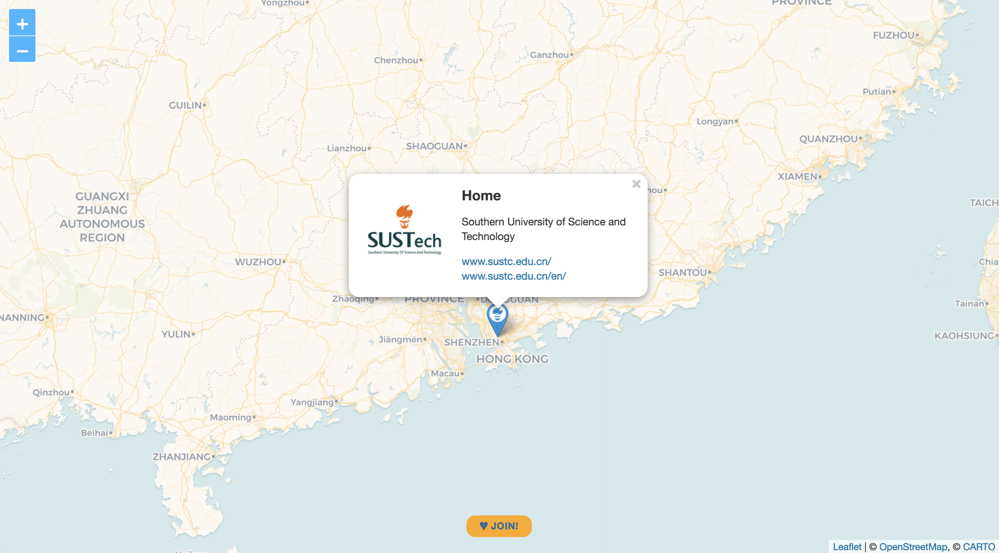

# SUSTech Alumni Map

A map filled with SUSTech alumni who are willing to help current SUSTech students in their application procedure. Hosted at GitHub, which allows for everyone to add their map entries. ♥ Join us!

👉 __https://sustech-application.github.io/SUSTech-Alumni-Map/__

The screenshot above shows what user entries look like. You’ll even get your own URL for your entry, which is awesome! Look, this is a [link to SUSTech](https://sustech-application.github.io/SUSTech-Alumni-Map/#home).

## How to add and manage your entry?

You can add your marker to the map and manage your data by yourself. Learn about [3 ways how to manage your entry](https://github.com/SUSTech-Application/SUSTech-Alumni-Map/tree/master/_directory)! 🚀

## Who’s the map for?

The map is for any SUSTech student or staff: undergraduates, graduates et al. It’s about visualizing the distribution of SUSTech alumni. If you are one of SUSTech, the map is for you!

## How does this map work?

No big deal: GitHub allows to generate static websites out of repositories. They make use of [Jekyll](https://jekyllrb.com), a ruby based generator. Jekyll comes with [Liquid](https://shopify.github.io/liquid/) templates, which helped us to inject all our map entries within a JSON at the bottom of the HTML. JavaScript grabs the data and starts a nice [Leaflet](http://leafletjs.com) map with beautiful tiles provided by [CARTO](https://carto.com/location-data-services/basemaps/).  
—Well, that’s it. ¯\\\_(ツ)_/¯

## How can I improve this site?

We’d recommend you to download the repo as zip file instead and make it run on your local machine first (see [SETUP.md](https://github.com/SUSTech-Application/SUSTech-Alumni-Map/blob/master/SETUP.md) for instructions).

In case you struggle, we’d love to help! 🙋‍♂️  

## How to run the map on my local machine?

See [SETUP.md](https://github.com/SUSTech-Application/SUSTech-Alumni-Map/blob/master/SETUP.md) for instructions.
